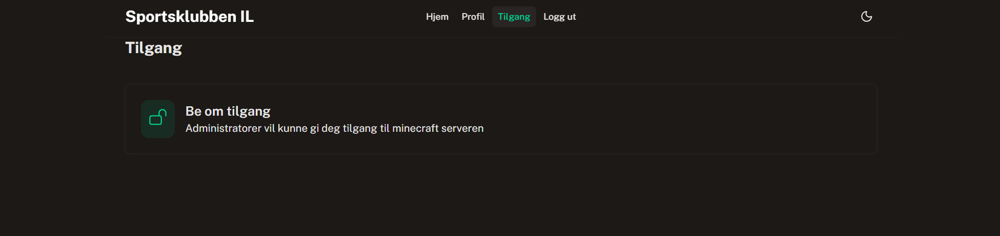
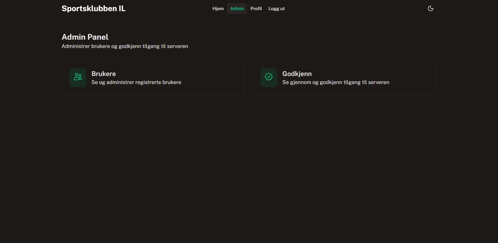

### Brukerveiledning – Sportsklubben IL

## Introduksjon

Sportsklubben IL er en webbasert plattform som gir medlemmer tilgang til klubbens Minecraft-server.

For å få tilgang til serverinformasjon må brukeren først opprette en konto og logge inn på systemet.

---

# Første gangs bruk

## Opprette bruker

Dersom du er ny bruker må du registrere en konto.

### Fremgangsmåte

1. Åpne nettsiden.
2. Velg **Registrer** i menyen øverst.
3. Fyll inn følgende informasjon:
   - Navn
   - Telefonnummer
   - E-postadresse
   - Passord
4. Klikk på **Opprett bruker**.


Når registreringen er fullført kan du logge inn i systemet.

---

# Innlogging

## Logg inn på kontoen din

For å få tilgang til medlemsområdet:

1. Klikk på **Login** i menyen for å logge inn på din bruker.

2. Oppgi e-postadresse og passord som du har laget.

3. Klikk på **Logg inn** når du har skrevet e-postadressen og passordet ditt.



# Admin-veiledning – Sportsklubben IL

## Tilgang til Admin-panelet
   For å få tak i en admin bruker, må man gå til backend for å  
   redigere på databasen og gjør den til admin bruker
1. Logg inn med en **admin-konto**.
2. Klikk på **Admin** i toppmenyen.

---

## Funksjoner

### Brukere
- Se og administrer registrerte brukere  
- Redigere informasjon  
- Endre roller (admin-rettigheter)  
- Deaktivere eller slette brukere

### Godkjenn
- Se nye søknader om servertilgang  
- Godkjenne eller avslå tilgang  
- Administrere tilgang til Minecraft-serveren



---

## Viktige tips
- Gi admin-rettigheter kun til betrodde personer  
- Sjekk **Godkjenn** jevnlig  
- Hold brukerlisten ryddig  
- Vær forsiktig ved sletting av brukere

## Oversikt

Her finner du:

- Minecraft-serverens IP-adresse
- Serverstatus
- Viktige meldinger
- Informasjon om serveren

---

## Server-IP

Når du er logget inn og har fått godkjent tilgangsforespørsel vil serverens IP-adresse vises på info siden.

Eksempel:

```text
play.sportsklubbenil.no
