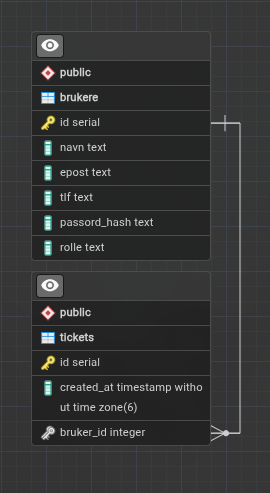

# Teknisk dokumentasjon

## Teknologi stack

### Nuxt

Nuxt er et full stack-rammeverk som er bygget på Vue.js, og vi har bestemt at dette er det beste rammeverket for oss på grunn av moduløkosystemet med moduler som for eksempel Nuxt UI. Nuxt har også et bra og enkelt system for autentisering og middleware.

### Nuxt UI

Nuxt UI er en modul man kan bruke hvis man bruker Nuxt. Modulen er et frontendbibliotek som hjelper oss med styling av nettsiden slik at vi kan få et profesjonelt design uten å bruke for mye tid på det. Sammen med Tailwind CSS gjør dette det enklere å lage et moderne og responsivt design.

### Nitro

Nitro er backend-løsningen som følger med Nuxt. Den gjør det enkelt å lage API-endepunkter og håndtere serverlogikk uten å måtte sette opp et eget backend-rammeverk.

### Node.js og TypeScript

Backenden kjører på Node.js, og vi bruker TypeScript som programmeringsspråk. TypeScript gjør koden mer oversiktlig og reduserer muligheten for feil ved hjelp av type sjekking.

### Prisma

Prisma hjelper oss med å kommunisere med databasen. Ved å bruke Prisma reduserer vi muligheten for feil og SQL-injections, samtidig som databaseoperasjoner blir enklere å håndtere.

### PostgreSQL

Vi valgte PostgreSQL fordi det gir oss muligheten til å få et godt oppsett med en relasjonell database med god skalerbarhet og ytelse.

### Git og GitHub

Vi bruker Git til versjonskontroll, som hjelper oss med å holde styr på endringer i koden. GitHub bruker vi som plattform til lagring, samarbeid og deling av prosjektet.

### npm

Vi bruker npm til å installere og administrere pakkene og avhengighetene som prosjektet trenger.

## Database

Databasen består av to tabeller: Brukere og Tickets.

Eneste relasjonen i databasen er id fra brukere kobles til bruker_id i tickets som foreign key.

Databasen er normalisert til 3NF, ettersom det er en veldig enkel database var ikke dette vanskelig å få til.

## API-endepunkter

API-et er delt inn i tre hovedområder: autentisering, brukere og tilgangsforespørsler.

### Autentisering

* **GET /api/auth/me** – Henter informasjon om innlogget bruker.
* **POST /api/login** – Logger inn en bruker og oppretter en cookie.
* **POST /api/logout** – Logger ut brukeren.

### Brukere

* **GET /api/users** – Henter alle brukere.
* **GET /api/users/[id]** – Henter én spesifikk bruker.
* **POST /api/users** – Registrerer en ny bruker.
* **DELETE /api/users/[id]** – Sletter en bruker.
* **PUT /api/users/rolle** – Oppdaterer en brukers rolle til deltaker.

### Tilgangsforespørsler

* **GET /api/tickets** – Henter alle tilgangsforespørsler.
* **GET /api/tickets/[id]** – Henter én forespørsel.
* **POST /api/tickets** – Oppretter en ny tilgangsforespørsel.
* **DELETE /api/tickets** – Sletter en tilgangsforespørsel etter behandling.

## Autentisering og autorisering

* Innlogging med e-post og passord
* Passord verifiseres mot lagret hash
* HTTP-only cookie brukes til å holde brukeren innlogget
* `/api/auth/me` brukes til å hente innlogget bruker
* Rollebasert tilgangskontroll

  * `bruker`
  * `deltaker`
  * `admin`
* Middleware beskytter sider basert på rolle

## Sikkerhet

* Passord hashes før lagring i databasen
* Passord lagres aldri i klartekst
* HTTP-only cookies beskytter mot tilgang fra JavaScript
* Validering av innloggingsinformasjon
* Rollebasert tilgang til administrative funksjoner
* Databasen bruker primærnøkler og relasjoner for å sikre dataintegritet
